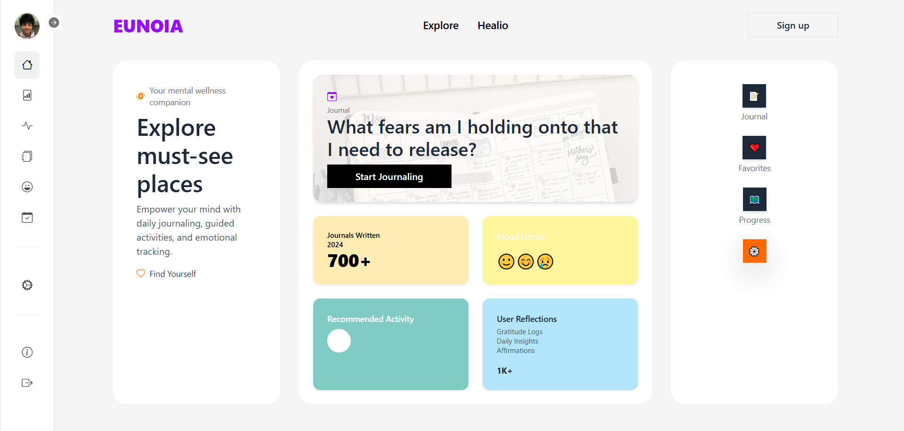
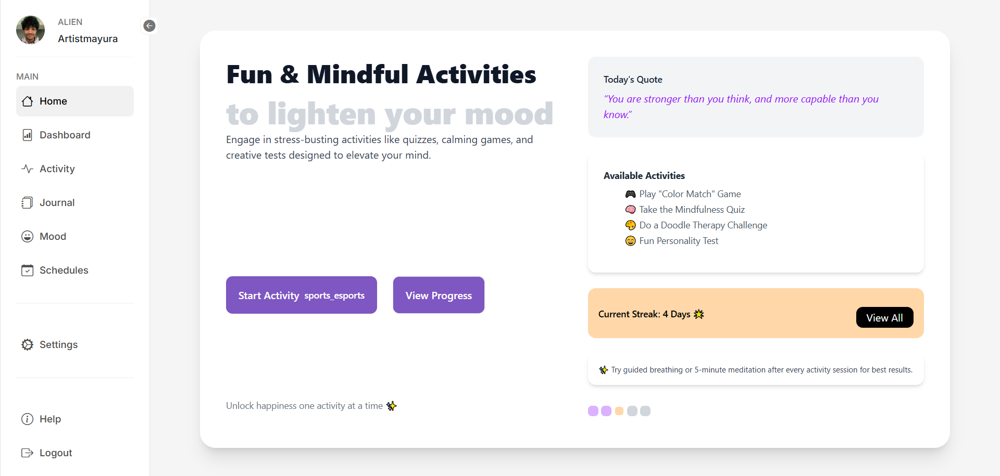

# 🧠 Mental Health Support Application

A full-stack Mental Health Support web application that empowers users to track their moods, journal their thoughts, engage in stress-relieving activities, and schedule doctor appointments — all within a secure and user-friendly environment.



---

## 🌐 Live Demo

> **Frontend**: [Live Link Here](#)  
> **Backend**: [Backend Repo](#)  
> *(Add actual links once deployed)*

---

## 🧩 Tech Stack

- **Frontend**: Angular, Bootstrap  
- **Backend**: Java, Spring Boot  
- **Database**: MySQL  
- **Authentication**: JWT, BCrypt  
- **ORM**: Hibernate  
- **Deployment**: *(Add deployment info if applicable)*

---

## ✨ Features

### 👤 User Features

- 📝 **Mood Tracking** – Select from emojis, log mood, and receive insights  
- 📖 **Journaling** – Write self-reflections and track journal history  
- 🎮 **Activities** – Quizzes and relaxing games to reduce stress  
- 🩺 **Doctor Appointments** – Book and manage consultation slots  
- 📊 **Dashboard** – Visual mood logs, journal stats, and activity trends  
- 🔐 **Authentication** – Secure signup/login using JWT and password hashing

### 🛠️ Admin Features *(Future Scope)*

- Manage doctors and slots  
- Monitor user engagement  
- Moderate content and activities

---

## 🧱 Architecture

### 🔙 Backend (Spring Boot)

- REST APIs for mood, journal, activities, and appointments  
- Entity management via Hibernate (OneToOne, ManyToOne mappings)  
- Authentication with JWT + BCrypt  
- Bean Validation for data integrity

### 🌐 Frontend (Angular)

- Modular components: Home, Mood, Journal, Activities, Dashboard, Scheduling  
- Responsive UI using Bootstrap  
- Routing, services, and form validation

---

## 🔒 Security

- ✅ JWT-based authentication  
- 🔒 Password encryption with BCrypt  
- ✔️ Input validation using Java Bean Validation  

---

## 🚀 Deployment

*(Update with Vercel, Render, AWS, or any deployment steps)*

---

## 🛠️ Setup & Installation

### 📦 Backend (Spring Boot)

```bash
git clone <backend-repo-url>
cd backend
# Set MySQL DB in application.properties
mvn spring-boot:run
